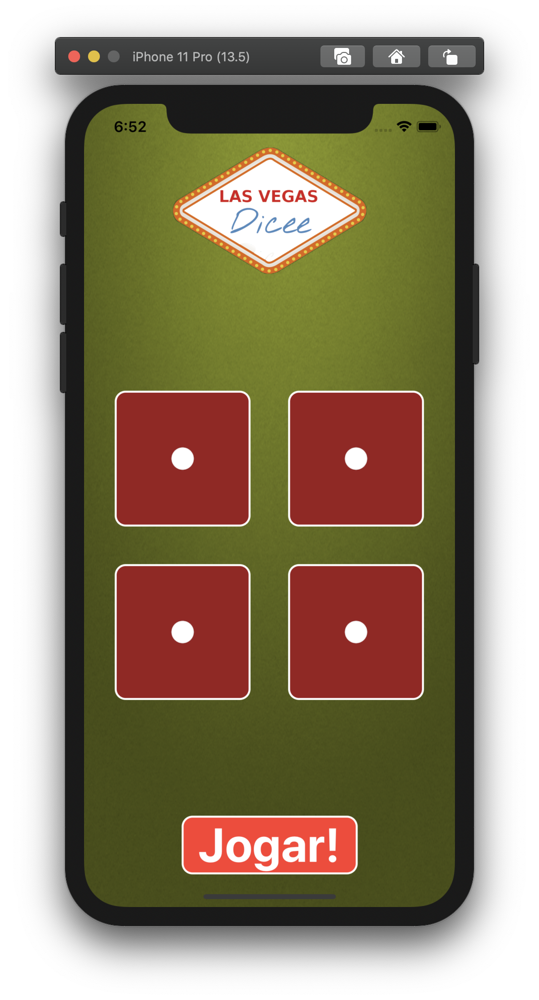

# Dicee-SwiftUI

Minha solução do app "Dicee", da seção 17 do curso [iOS 13 & Swift 5 - The Complete iOS App Development Bootcamp](https://www.udemy.com/course/ios-13-app-development-bootcamp/?referralCode=D3530B180A3ECABC6056%22), com algumas alterações.

## Screenshot

 
